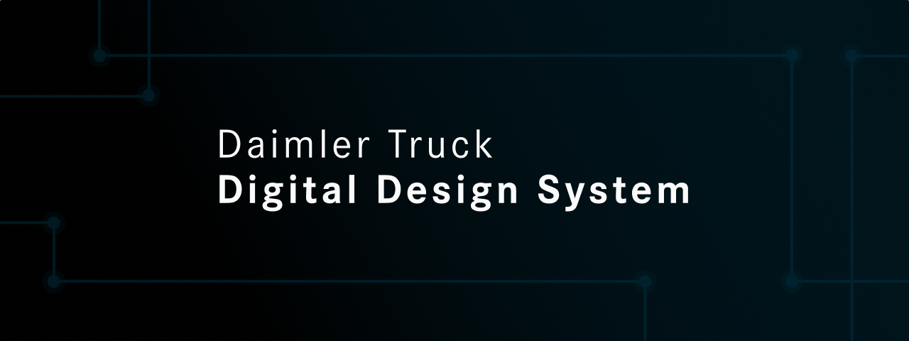

<div align="center">

</div>

<br/>

<div align="center">Component library for Daimler Truck Digital Design System.<br>
It contains UI components, brand themes, examples and documentation.</div>

#

#### **DT-DDS provides:**

- A unified group of utility functions commonly used, and spread across different projects
- A unified group of reusable UI components commonly used, and spread across different projects
- W3C standards, common tooling, and high quality through CI/CD lifecycle
- Accessibility meeting WCAG 2.1 AA standards
- Faster developments and implementations
- Easy collaboration and Maintenance
- Versioning and changelogs
- Documentation

#### **Documentation via:**

- [Storybook/Developer documentation](https://daimlertruck.github.io/DT-DDS/)
- [Figma (private design files)](https://www.figma.com/file/RdxGI4OUcKDRfBRPmBJXbW/DT_UI-Design-System)

## 📦 Installation

`@dt-dds/react` uses CSS-IN-JS behind the scenes. You'll also need to add Emotion as a project dependency.

```bash
yarn add @dt-dds/react @emotion/css @emotion/react @emotion/styled
```

## 🔨 Usage

Import the DT-DDS global styles in the root component.

```tsx
import '@dt-dds/react/index.css';
```

And wrap your code in a `ThemeProvider` component to make it available to all components.

```tsx
import { Provider as ThemeProvider, theme } from '@dt-dds/react';

function App() {
  return <ThemeProvider theme={theme}>
    ...
  <ThemeProvider/>
}
```

We provide a default Daimler Truck theme, available under the package `react-core/themes`

### Package Release Status

<!-- PACKAGES_TABLE_START -->
| Package | Version |
|---------|---------|
| [`@dt-dds/react`](https://github.com/daimlertruck/DT-DDS/tree/main/packages/dt-dds-react) | 1.0.0-beta.327 |
| [`@dt-dds/fonts`](https://github.com/daimlertruck/DT-DDS/tree/main/packages/fonts) | 1.0.0-beta.9 |
| [`@dt-dds/icons`](https://github.com/daimlertruck/DT-DDS/tree/main/packages/icons) | 1.0.0-beta.7 |
| [`@dt-dds/react-accordion`](https://github.com/daimlertruck/DT-DDS/tree/main/packages/react-packages/accordion) | 1.0.0-beta.64 |
| [`@dt-dds/react-app-header`](https://github.com/daimlertruck/DT-DDS/tree/main/packages/react-packages/app-header) | 1.0.0-beta.71 |
| [`@dt-dds/react-avatar`](https://github.com/daimlertruck/DT-DDS/tree/main/packages/react-packages/avatar) | 1.0.0-beta.75 |
| [`@dt-dds/react-backdrop`](https://github.com/daimlertruck/DT-DDS/tree/main/packages/react-packages/backdrop) | 1.0.0-beta.62 |
| [`@dt-dds/react-box`](https://github.com/daimlertruck/DT-DDS/tree/main/packages/react-packages/box) | 1.0.0-beta.77 |
| [`@dt-dds/react-breadcrumb`](https://github.com/daimlertruck/DT-DDS/tree/main/packages/react-packages/breadcrumb) | 1.0.0-beta.75 |
| [`@dt-dds/react-button`](https://github.com/daimlertruck/DT-DDS/tree/main/packages/react-packages/button) | 1.0.0-beta.109 |
| [`@dt-dds/react-card`](https://github.com/daimlertruck/DT-DDS/tree/main/packages/react-packages/card) | 1.0.0-beta.43 |
| [`@dt-dds/react-checkbox`](https://github.com/daimlertruck/DT-DDS/tree/main/packages/react-packages/checkbox) | 1.0.0-beta.65 |
| [`@dt-dds/react-core`](https://github.com/daimlertruck/DT-DDS/tree/main/packages/react-packages/core) | 1.0.0-beta.60 |
| [`@dt-dds/react-date-picker`](https://github.com/daimlertruck/DT-DDS/tree/main/packages/react-packages/date-picker) | 1.0.0-beta.109 |
| [`@dt-dds/react-divider`](https://github.com/daimlertruck/DT-DDS/tree/main/packages/react-packages/divider) | 1.0.0-beta.59 |
| [`@dt-dds/react-drawer`](https://github.com/daimlertruck/DT-DDS/tree/main/packages/react-packages/drawer) | 1.0.0-beta.71 |
| [`@dt-dds/react-dropdown`](https://github.com/daimlertruck/DT-DDS/tree/main/packages/react-packages/dropdown) | 1.0.0-beta.104 |
| [`@dt-dds/react-empty-state`](https://github.com/daimlertruck/DT-DDS/tree/main/packages/react-packages/empty-state) | 1.0.0-beta.133 |
| [`@dt-dds/react-form`](https://github.com/daimlertruck/DT-DDS/tree/main/packages/react-packages/form) | 1.0.0-beta.57 |
| [`@dt-dds/react-icon`](https://github.com/daimlertruck/DT-DDS/tree/main/packages/react-packages/icon) | 1.0.0-beta.64 |
| [`@dt-dds/react-icon-button`](https://github.com/daimlertruck/DT-DDS/tree/main/packages/react-packages/icon-button) | 1.0.0-beta.30 |
| [`@dt-dds/react-label-field`](https://github.com/daimlertruck/DT-DDS/tree/main/packages/react-packages/label-field) | 1.0.0-beta.62 |
| [`@dt-dds/react-link`](https://github.com/daimlertruck/DT-DDS/tree/main/packages/react-packages/link) | 1.0.0-beta.88 |
| [`@dt-dds/react-message`](https://github.com/daimlertruck/DT-DDS/tree/main/packages/react-packages/message) | 1.0.0-beta.127 |
| [`@dt-dds/react-modal`](https://github.com/daimlertruck/DT-DDS/tree/main/packages/react-packages/modal) | 1.0.0-beta.111 |
| [`@dt-dds/react-pagination`](https://github.com/daimlertruck/DT-DDS/tree/main/packages/react-packages/pagination) | 1.0.0-beta.51 |
| [`@dt-dds/react-progress-bar`](https://github.com/daimlertruck/DT-DDS/tree/main/packages/react-packages/progress-bar) | 1.0.0-beta.57 |
| [`@dt-dds/react-radio`](https://github.com/daimlertruck/DT-DDS/tree/main/packages/react-packages/radio) | 1.0.0-beta.97 |
| [`@dt-dds/react-segmented-control`](https://github.com/daimlertruck/DT-DDS/tree/main/packages/react-packages/segmented-control) | 1.0.0-beta.53 |
| [`@dt-dds/react-select`](https://github.com/daimlertruck/DT-DDS/tree/main/packages/react-packages/select) | 1.0.0-beta.100 |
| [`@dt-dds/react-sidebar`](https://github.com/daimlertruck/DT-DDS/tree/main/packages/react-packages/sidebar) | 1.0.0-beta.9 |
| [`@dt-dds/react-spinner`](https://github.com/daimlertruck/DT-DDS/tree/main/packages/react-packages/spinner) | 1.0.0-beta.114 |
| [`@dt-dds/react-stepper`](https://github.com/daimlertruck/DT-DDS/tree/main/packages/react-packages/stepper) | 1.0.0-beta.58 |
| [`@dt-dds/react-table`](https://github.com/daimlertruck/DT-DDS/tree/main/packages/react-packages/table) | 1.0.0-beta.57 |
| [`@dt-dds/react-tabs`](https://github.com/daimlertruck/DT-DDS/tree/main/packages/react-packages/tabs) | 1.0.0-beta.110 |
| [`@dt-dds/react-tag`](https://github.com/daimlertruck/DT-DDS/tree/main/packages/react-packages/tag) | 1.0.0-beta.67 |
| [`@dt-dds/react-text-area`](https://github.com/daimlertruck/DT-DDS/tree/main/packages/react-packages/text-area) | 1.0.0-beta.94 |
| [`@dt-dds/react-text-field`](https://github.com/daimlertruck/DT-DDS/tree/main/packages/react-packages/text-field) | 1.0.0-beta.123 |
| [`@dt-dds/react-toast`](https://github.com/daimlertruck/DT-DDS/tree/main/packages/react-packages/toast) | 1.0.0-beta.127 |
| [`@dt-dds/react-toggle`](https://github.com/daimlertruck/DT-DDS/tree/main/packages/react-packages/toggle) | 1.0.0-beta.40 |
| [`@dt-dds/react-tooltip`](https://github.com/daimlertruck/DT-DDS/tree/main/packages/react-packages/tooltip) | 1.0.0-beta.71 |
| [`@dt-dds/react-typography`](https://github.com/daimlertruck/DT-DDS/tree/main/packages/react-packages/typography) | 1.0.0-beta.51 |
| [`@dt-dds/themes`](https://github.com/daimlertruck/DT-DDS/tree/main/packages/themes) | 1.0.0-beta.15 |
<!-- PACKAGES_TABLE_END -->

## 💻 Contributing

See the [contributing guidelines](CONTRIBUTING.md) on how to contribute to this repository, including issue creation, GitHub Workflow and Coding standards and guidelines.

## &copy; License

Licensed under [MIT License](LICENSE.md)
